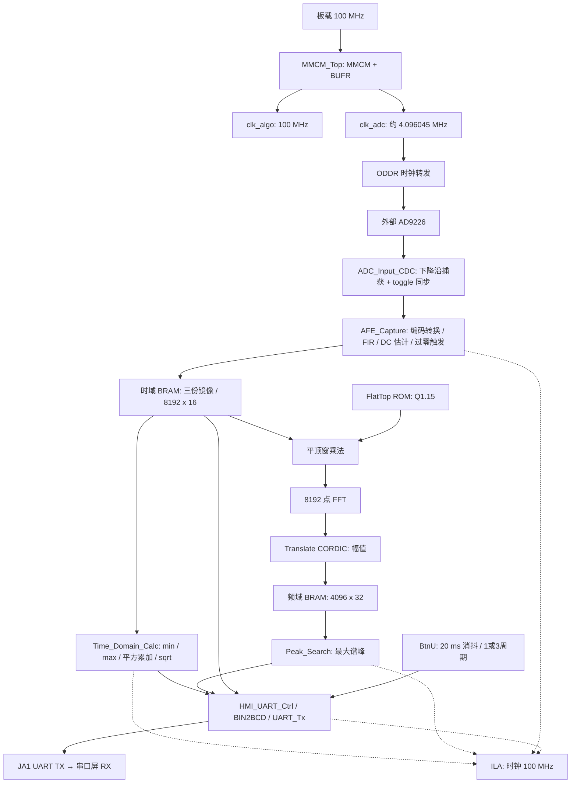

# 周期信号测量分析装置：Basys 3 / AD9226 / UART 串口屏

纯 FPGA 周期信号采集、时域测量、频谱分析与显示实验工程。目标平台为 Basys 3（Artix-7 `xc7a35tcpg236-1`），外接 AD9226 12-bit 并行 ADC 和淘晶驰协议 UART 屏，不使用 MCU。

本文按照“设计目标—系统原理—实验搭建—验证结果—局限与改进”的结构记录工程。项目名称来自竞赛练习背景，不表示官方赛题确认或指标验收通过。文档核对日期：2026-09-15。

> 当前状态：已有 RTL、IP 脚本、引脚约束、四组自检仿真，以及较早版本的实现报告；尚未实测。最新 RTL 修复之后需要重新实现并生成 bitstream。连续采集的帧一致性、波形负值映射和幅值标定仍有待处理，不能据此宣称已达到 ≤5 mV 误差。

## 目录

- [1. 设计目标与实际参数](#1-设计目标与实际参数)
- [2. 系统架构与工作原理](#2-系统架构与工作原理)
- [3. 工程文件与 IP](#3-工程文件与-ip)
- [4. 硬件连接](#4-硬件连接)
- [5. 串口屏工程配置](#5-串口屏工程配置)
- [6. Windows 构建与仿真](#6-windows-构建与仿真)
- [7. 上机实验步骤与预期现象](#7-上机实验步骤与预期现象)
- [8. ILA 观察方法](#8-ila-观察方法)
- [9. 验证记录与证据边界](#9-验证记录与证据边界)
- [10. 标定与验收实验](#10-标定与验收实验)
- [11. 已知问题与排障](#11-已知问题与排障)
- [12. 参考资料与维护约定](#12-参考资料与维护约定)

## 1. 设计目标与实际参数

| 项目 | 目标/当前实现 | 说明 |
| --- | --- | --- |
| FPGA | Artix-7 XC7A35T，CPG236，-1 | Basys 3 |
| 板载输入时钟 | 100 MHz | W5 |
| 算法时钟 | 100 MHz | FIR、BRAM、FFT、CORDIC、UART 控制均在此域 |
| ADC 时钟 | 目标 4.096 MHz；实际约 4.0960452 MHz | MMCM + BUFR /3，ODDR 转发出板 |
| 输入数据 | 12-bit，默认 Offset Binary | 必须核对模块输出编码 |
| 每帧长度 | 8192 点 | 名义采集时间 2 ms，不含等待触发 |
| FFT | 8192 点，Radix-4 Burst I/O，定点 Unscaled | 非实时 AXI 流，自然顺序输出 |
| 频率格点 | 代码按 500 Hz/bin 换算 | 依实际时钟约为 500.0055 Hz/bin |
| 目标信号范围 | 10 kHz～500 kHz | 对应名义 bin 20～1000 |
| 当前谱峰扫描 | bin 10～4000，含端点 | 约 5 kHz～2 MHz，并非只搜目标频带 |
| 串口 | 115200 bps，8N1，只有 TX | 每 bit 868 拍，实际约 115207 bps |
| 波形显示 | 400 点，1 或 3 个周期 | BtnU 切换；按整数量化周期抽样 |
| 幅值单位 | 当前为内部数字量 | 尚未完成到输入端 mV 的标定 |

实际采样时钟比名义值高约 11 ppm，不是严格的 4.096000 MHz。当前频率公式仍固定为 `index × 500`。平顶窗改善幅值的离栅格误差，但不能自动提高 500 Hz 格点的频率分辨率。

## 2. 系统架构与工作原理

### 2.1 模块连接



不支持 Mermaid 的阅读器可参考：

```text
G_FPGA_Top
├── MMCM_Top ── 100 MHz 算法时钟
│             └─ MMCM 辅助时钟 → BUFR /3 → ADC 时钟 → ODDR → JB1
├── Reset_Synchronizer ×2：各时钟域复位释放同步
├── Button_Debounce：BtnU → 1/3 周期选择
├── Capture_Calc_Subsystem
│   ├── ADC_Input_CDC → AFE_Capture → 时域 BRAM（三份同写镜像）
│   ├── 时域读口 → Time_Domain_Calc → Vpp / Vrms
│   ├── FFT 读口 → 平顶窗 ROM/乘法 → FFT → CORDIC → 频域 BRAM
│   │                                                   └→ Peak_Search
│   └── HMI 读口 + 测量结果 → BCD/命令拼装 → UART_Tx
└── ila_system：帧完成、测量值、谱峰索引、HMI 状态
```

### 2.2 时钟、复位与跨时钟域

Clocking Wizard 的辅助输出约为 12.2881356 MHz，再由 BUFR 三分频得到 ADC 时钟；并非直接要求 MMCM 输出严格的 4.096 MHz。ODDR 使用 `D1=1、D2=0` 转发时钟。ADC 数据在 `clk_adc` 下降沿寄存，通过保持数据总线和同步 toggle 标志交给 100 MHz 域。

这是一种 bundled-data CDC，**不是异步 FIFO**。它依赖源数据在目的端接收前保持稳定；约 24.4 个算法周期/采样点的余量不能替代 CDC 验证。XDC 中的跨域 false path 也不等于证明数据一致性。

BtnC 按下为高电平。顶层端口虽然叫 `sys_rst_n`，但默认 `BUTTON_ACTIVE_HIGH=1`，即**按下复位，松开运行**。不能仅因 `_n` 后缀再外加一次反相。MMCM 未锁定时保持系统复位，各域独立同步释放。

### 2.3 采集与时域计算

1. 默认把 ADC 码减去 2048，再左移 4 位，转换为 signed 16-bit 数据。
2. FIR 使用 95 taps 低通系数，设计目标为通带 600 kHz、阻带 900 kHz；实际通带增益和阻带衰减仍需测量。
3. 整数 IIR 估计残余 DC，默认为 `dc += (x-dc) >>> 12`。它不是逐帧精确求均值，整数截断可留下残余偏置。
4. 等待 4096 个有效滤波样本预热，再检测非正到正的过零，记录连续 8192 点。写入完成后产生 `frame_valid`。
5. 时域 FSM 遍历 BRAM，计算 `Vpp = max - min`、平方和、`mean_square = sum >> 13`，再由 Square Root CORDIC 求 RMS。

时域数据为 signed 16-bit；Vpp 接口为 unsigned 17-bit，Vrms 为 unsigned 16-bit，平方和为 44-bit。RMS 输入是 AFE 已处理的数据，不是时域 FSM 再次减去了精确帧均值。

三份时域 BRAM 共享写入、各有独立同步读口，分别服务时域计算、FFT 和 HMI。**镜像解决读口争用，不解决帧冻结。** 当前采集完成后会继续采下一帧，没有等待消费者完成；后续写入可能覆盖尚在读取的数据，尤其 UART 波形发送期间。

### 2.4 窗函数、FFT 与谱峰

平顶窗为对称窗，`θ = 2πn/(8192-1)`：

```text
w[n] = 0.21557895 - 0.41663158 cos(θ)
     + 0.277263158 cos(2θ) - 0.083578947 cos(3θ)
     + 0.006947368 cos(4θ)
```

系数四舍五入为 signed Q1.15，并饱和到 -32768～32767。时域数据乘窗得到 signed 32-bit，右移 15 位并饱和回 16-bit 后送 FFT。

FFT 配置通道发送 `8'h01` 选择正变换，数据/配置均按 `tvalid && tready` 接受。FFT 为 Unscaled，不使用 scaling schedule；输出实虚部各有 30 个有效位，分别装入 32-bit 槽。RTL 将实虚部各右移 1 位后送入 Translate CORDIC，将幅值写入前 4096 个 bin；其余 FFT 输出仍被接收，不能在半帧处停止排空。当前有一级输出缓冲，握手性质仍需更强的随机背压测试。

`Peak_Search` 找的是扫描区间中**幅值最大的频率分量**，不一定是真正基频。例如二次谐波更强时会报告二次谐波。当前没有谐波族判决、前三/四谐波列表或亚 bin 插值。

`MAG_SCALE_FACTOR` 默认 1，是整数倍率并带饱和，不是任意小数标定系数。平顶窗相干增益约 0.21555；实际补偿还涉及 FFT、CORDIC 定点格式和前端增益，不可直接将原始幅值标成 mV。

### 2.5 显示与吞吐量

| 控件 | 当前发送内容 | 单位 |
| --- | --- | --- |
| `t0` | Vpp | 内部数字量，不是 mV |
| `t1` | Vrms | 内部数字量，不是 mV |
| `t2` | `max_index × 500` | Hz |
| `t3` | `amp_f1` | 未标定频谱幅值 |

命令示例：`t0.txt="250"`，随后为三个真正的 `0xFF` 字节；波形为 `add 1,0,Y` 加同样结束符。不存在额外换行，也不是发送可打印字符串 `\xff`。BIN2BCD 使用 Double Dabble，支持当前 32-bit 数值的 10 位十进制输出。

名义周期样本数为 `N_cycle = floor(8192/max_index)`；一/三周期跨度为 `min(周期数 × N_cycle - 1, 8191)`，400 个点按 `floor(p × span / 399)` 取地址。索引为零时使用整帧范围。100 kHz 对应 bin 200，整数周期只有 40 点；500 kHz 每周期约 8 点，重复取样填满屏幕不会增加真实信息。

每点命令约 12～14 字节，400 点仅串口传输就需约 0.42～0.49 秒，另有文本和计算开销，因此屏幕不可能跟随每个 2 ms ADC 帧刷新。按钮效果在后续显示批次体现。当前忙期间只保留最新更新而不是无限排队；这也带来第 11 节的批次一致性风险。

## 3. 工程文件与 IP

```text
G_FPGA.xpr                     Vivado 工程入口
sources/
├── rtl/                       顶层、采集、计算、FFT、显示和存储 RTL
├── constraints/Basys3_Pinout.xdc
├── coeffs/                    FIR / Flat-top COE
└── ip/                        IP 配置与生成文件
scripts/
├── setup_capture_calc.tcl      第一阶段：FIR、sqrt 与采集/时域模块
├── generate_flattop.py         标准库 Python，生成平顶窗 COE
├── setup_fft_uart.tcl          第二阶段：ROM、FFT、Translate 与显示模块
├── setup_board_top.tcl         第三阶段：时钟、ILA、XDC、绝对顶层
├── impl_check_board_top.tcl    全流程到 write_bitstream 并输出报告
└── run_behavioral_sim.ps1      四组独立 XSim 自检仿真
sim/                           SystemVerilog 测试平台
reports/                       已保存报告，注意时间与版本
docs/                          分阶段接口与 IP 配置说明
```

入口代码：[G_FPGA_Top.v](sources/rtl/G_FPGA_Top.v)、[Capture_Calc_Subsystem.v](sources/rtl/Capture_Calc_Subsystem.v)、[约束文件](sources/constraints/Basys3_Pinout.xdc)。

| IP/存储 | 主要配置或实现 |
| --- | --- |
| FIR Compiler | 95 taps，低通 COE，采样有效使能，算法域 100 MHz |
| Square Root CORDIC | Unsigned Integer，输入 32-bit；有效输出 17-bit，AXI 槽 24-bit |
| Flat-top ROM | Block Memory Generator，Single Port ROM，8192 × 16，COE 初始化 |
| FFT | 8192，Radix-4 Burst I/O，Fixed Point，Unscaled，Natural Order，Non-Realtime |
| Translate CORDIC | Signed Fraction，输入 30-bit，输出 31-bit；粗旋转及增益补偿 |
| Clocking Wizard | 算法 100 MHz，辅助约 12.2881356 MHz，之后 BUFR /3 |
| ILA | 100 MHz，6 个 probe，深度 1024 |
| 时域/频域 BRAM | RTL 推断；时域三份 8192 × 16 镜像，频域 4096 × 32 |

详细参数以三个 `setup_*.tcl` 和当前 RTL 为准。[第一阶段说明](docs/CAPTURE_CALC.md)、[第二阶段说明](docs/FFT_UART.md)保留接口/定点设计过程；其中阶段顶层、时钟或旧流程描述不应覆盖本文的最终板级连接。

## 4. 硬件连接

### 4.1 接线前检查

断电接线。准备 Basys 3、USB/JTAG 数据线、AD9226 模块及对应供电、串口屏及其电源、信号源和示波器。

- 所有 FPGA 外部信号采用 LVCMOS33。**先确认 ADC 数据输出和屏幕串口电平兼容 3.3 V，再直连。** AD9226 模拟供电与输出驱动供电不同；模块使用 5 V 电源不代表输出一定是 3.3 V，也不代表一定是 5 V。查模块原理图并测量。[AD9226 数据手册](https://www.analog.com/media/en/technical-documentation/data-sheets/AD9226.pdf)
- 不要把 5 V 逻辑、RS-232 正负电压或 RS-485 差分线直接接入 PMOD；必要时使用匹配的接口转换电路。
- 屏幕和 ADC 按各自模块规格供电，不要默认用 PMOD 3.3 V 引脚驱动大功率屏幕。FPGA、ADC、屏幕和信号源参考地按实验系统要求共地。
- 当前由 FPGA 向 ADC 送时钟。若 ADC 模块带振荡器，先确认外部时钟选择方式，避免两个时钟输出互相驱动。
- 模拟信号接模块模拟输入及合适前端，不接 FPGA PMOD。量程、偏置、耦合方式和双极性输入支持取决于具体模块，不能假定任意 AD9226 模块可以直接接负电压。时钟/数据线尽量短，配合可靠地线。

### 4.2 引脚表

表格与仓库 XDC 对应。JB1 表示 **JB 连接器第 1 针**，不是芯片封装脚。PMOD 信号针号为 1、2、3、4、7、8、9、10；5/11 为 GND，6/12 为 3.3 V。按丝印/官方图确认朝向，不把第二排信号误认成第 5、6 针。[Basys 3 参考手册](https://digilent.com/reference/_media/reference/programmable-logic/basys-3/basys3_rm.pdf)

| RTL 端口 | 板上资源/PMOD | FPGA 封装脚 | 连接说明 |
| --- | --- | --- | --- |
| `sys_clk` | 板载晶振 | W5 | 已在板上连接，不外接 |
| `sys_rst_n` | BtnC，中间键 | U18 | 按下高有效复位 |
| `key_cycle` | BtnU，上键 | T18 | 1/3 周期切换 |
| `uart_tx` | JA1 | J1 | 接屏幕 UART RX |
| `adc_clk_out` | JB1 | A14 | 接 ADC 外部采样时钟输入 |
| `adc_data_in[0]` | JB2 | A16 | ADC 数据最低位 |
| `adc_data_in[1]` | JB3 | B15 | ADC 数据位 1 |
| `adc_data_in[2]` | JB4 | B16 | ADC 数据位 2 |
| `adc_data_in[3]` | JB7 | A15 | ADC 数据位 3 |
| `adc_data_in[4]` | JB8 | A17 | ADC 数据位 4 |
| `adc_data_in[5]` | JB9 | C15 | ADC 数据位 5 |
| `adc_data_in[6]` | JB10 | C16 | ADC 数据位 6 |
| `adc_data_in[7]` | JC1 | K17 | ADC 数据位 7 |
| `adc_data_in[8]` | JC2 | M18 | ADC 数据位 8 |
| `adc_data_in[9]` | JC3 | N17 | ADC 数据位 9 |
| `adc_data_in[10]` | JC4 | P18 | ADC 数据位 10 |
| `adc_data_in[11]` | JC7 | L17 | ADC 数据最高位 |
| GND | PMOD GND 或合适板上地 | — | 接 ADC/屏幕信号地 |

引脚依据：[Digilent Basys-3 Master XDC](https://github.com/Digilent/digilent-xdc/blob/master/Basys-3-Master.xdc)。ADC 芯片手册将 BIT1 定义为 MSB、BIT12 为 LSB，不要直接把芯片 BIT1 当成模块“数据位 1”；按模块总线实际位权接线。[AD9226 数据手册](https://www.analog.com/media/en/technical-documentation/data-sheets/AD9226.pdf)

屏幕 TX 当前不连接 FPGA；顶层没有 UART RX。ADC OTR 等附加信号没有顶层输入。Basys 3 自带 USB-UART 也不是 JA1 这条串口；在 PC 上检查命令，需另用电平兼容的 USB-TTL 接收器接 JA1 和 GND。

## 5. 串口屏工程配置

仓库目前不包含针对具体屏幕型号的 `.HMI` / `.TFT` 界面工程，仅有 FPGA 发送端。先用适配该型号的厂商编辑器建立并烧录页面：

1. 在启动后可见页面创建文本控件，名称严格为 `t0`、`t1`、`t2`、`t3`；宽度容纳最多 10 位数字。单位先写“raw / Hz”，不要提前写 mV。
2. 创建曲线控件，使其**组件数字 ID 为 1**、通道 0 可用，横向约 400 点，纵向可承载 0～255 坐标。`add 1,0,Y` 的 1 是组件 ID，不是名称；创建顺序可能影响 ID，必须检查，避免与文本控件冲突。
3. 将屏幕串口设为 115200、8N1，确认重启后仍保持。FPGA 没有自动设置屏幕波特率的初始化流程，也不读取 ACK。
4. 先用独立 USB-TTL 测试文本和 add 指令，确认三个二进制 FF 结束符有效，再换为 FPGA TX。不要同时把两个发送器接到屏幕 RX。
5. 换用不同控件 ID、页面或协议时，同步修改命令拼装逻辑。当前由 BtnU 切换周期，屏幕触摸事件不会被 FPGA 接收。

## 6. Windows 构建与仿真

### 6.1 环境与工程识别

已使用 Windows + Vivado 2025.2，安装目录 `C:\AMDDesignTools\2025.2\Vivado\bin`。Python 3 只用于生成 COE，无需 NumPy。其他 Vivado 版本需检查 IP 兼容性与升级记录。

PowerShell 中进入仓库，关闭同工程其他 Vivado 构建，避免并发修改：

```powershell
Set-Location -LiteralPath 'C:\Users\Joe\Documents\Verilog\G_FPGA'
$vivadoExe = 'C:\AMDDesignTools\2025.2\Vivado\bin\vivado.bat'
$projectFile = (Resolve-Path -LiteralPath '.\G_FPGA.xpr').Path
```

在 Vivado GUI 打开 `G_FPGA.xpr`，Tcl Console 检查：

```tcl
get_property PART [current_project]
get_property BOARD_PART [current_project]
get_property TOP [get_filesets sources_1]
```

器件应为 `xc7a35tcpg236-1`，最终顶层应为 `G_FPGA_Top`。板级脚本尝试选择已安装的 Basys 3 board part；未安装板卡文件时，可依靠正确 part 和完整 XDC 构建。**选择 board 不会自动证明自定义 ADC/UART 接线正确，最终以本项目 XDC 为准。**

### 6.2 生成系数并配置 IP

使用已有 `G_FPGA.xpr`；这些脚本不是“从不存在的工程创建 XPR”的入口。

```powershell
python .\scripts\generate_flattop.py
if ($LASTEXITCODE -ne 0) { throw 'COE generation failed' }

foreach ($setupName in @('setup_capture_calc.tcl', 'setup_fft_uart.tcl', 'setup_board_top.tcl')) {
    & $vivadoExe -mode batch -source (Join-Path '.\scripts' $setupName) -tclargs $projectFile
    if ($LASTEXITCODE -ne 0) { throw "Vivado setup failed: $setupName" }
}
```

最后运行板级脚本，因为阶段脚本可能设置阶段顶层。修改 IP 参数/COE 后重新生成相应 Output Products，检查 IP 状态，不要继续使用旧仿真模型或旧 bitstream。

### 6.3 行为/功能仿真回归

```powershell
powershell -NoProfile -ExecutionPolicy Bypass -File .\scripts\run_behavioral_sim.ps1 `
    -VivadoBin 'C:\AMDDesignTools\2025.2\Vivado\bin'
if ($LASTEXITCODE -ne 0) { throw 'Simulation regression failed' }
```

该入口调用 xvlog/xelab/xsim，运行四个独立自检平台，使用 RTL 与生成的 IP 功能模型；不是板级时序仿真。FFT 功能模型可能运行数分钟。脚本除退出码外还检查 `Fatal` / `ERROR` / `FAIL`，防止 XSim 在 `$fatal` 后仍返回成功码。

检查所有测试均通过，不只看最后进程退出码。`xsim.log` 可能被后续测试覆盖，保留终端输出并注明提交号。GUI 默认 `sim_1` 不等价于该四组回归，不能用“Run Simulation 没报错”替代。覆盖范围见第 9 节。

### 6.4 综合、实现与 bitstream

```powershell
& $vivadoExe -mode batch -source .\scripts\impl_check_board_top.tcl -tclargs $projectFile
if ($LASTEXITCODE -ne 0) { throw 'Synthesis / implementation failed' }
```

脚本重置并重跑 `synth_1` / `impl_1` 生成结果，运行至 `write_bitstream`。输出包括：

- `G_FPGA.runs/impl_1/G_FPGA_Top.bit`：下载文件。
- `G_FPGA.runs/impl_1/G_FPGA_Top.ltx` / `debug_nets.ltx`：ILA 探针文件，以本次生成文件为准。
- [时序报告](reports/board_top_timing.rpt)、[资源报告](reports/board_top_utilization.rpt)、[DRC](reports/board_top_drc.rpt)、[引脚报告](reports/board_top_io.rpt)、[时钟报告](reports/board_top_clocks.rpt)。

脚本自动要求 WNS > 0，但**仍需人工检查保持时间、TNS/THS、DRC、未约束路径和 CDC 例外**。ADC 输入延迟目前为 min 0 ns / max 8 ns 的占位值，需结合模块延迟、捕获边沿和走线完善。在这些假设下通过实现，不等于验证了真实外部接口时序。

## 7. 上机实验步骤与预期现象

### 7.1 下载前

1. 核查供电、逻辑电平、位序、共地和外部时钟选择，先不接大幅度模拟信号。
2. 用最新 RTL 完成仿真与实现，核对 bit/ltx 时间、提交号和顶层。不要直接沿用 2026-09-12 旧产物。
3. 给 Basys 3 正确供电，用 USB 数据线连接编程接口；屏幕完成界面下载和波特率配置。

### 7.2 Vivado JTAG 下载

打开 **Hardware Manager → Open Target → Auto Connect**，确认发现 XC7A35T。选择 **Program Device**，指定本次生成的 `.bit` 与同次构建 `.ltx`，下载后刷新硬件。

JTAG 下载配置在 SRAM 中，断电后不保留，重新上电需再次下载。配置 Flash 的持久化启动不在当前流程内，首次 JTAG 下载不等于烧录了启动镜像。

### 7.3 分层实验

| 次序 | 操作 | 预期现象 / 判断 |
| --- | --- | --- |
| 1 | 下载后松开 BtnC，示波器测 JB1 | 约 4.096045 MHz；没有时钟先查复位/下载/时钟，不直接查 FFT |
| 2 | 按下并松开 BtnC | 系统复位/重新预热，按键高有效 |
| 3 | 输入量程内、围绕模块允许工作点的 100 kHz 正弦 | ADC 不削顶，过零触发后应周期性出现 frame_valid |
| 4 | ILA 观察稳定结果 | 干净单音的最大峰预期靠近 bin 200，频率文本靠近 100000 Hz |
| 5 | 检查 JA1 | 空闲高，8N1，115200；可解出四条文本和 add 命令 |
| 6 | 查看屏幕 | 文本为原始幅值和 Hz；曲线协议有输出，但已知负值映射问题会影响形状 |
| 7 | 按 BtnU，等待后续显示批次 | 请求切换 1/3 周期，不应期望立即完成 400 点传输 |

零均值正弦的理论关系 `Vrms ≈ Vpp/(2√2)` 可作同尺度下粗检，但残余 DC、滤波、跨帧读取和截断会影响结果。未确认帧一致性时，不用一次屏显比值进行精度验收。

“完整一/三周期、平滑对称曲线”是修复后的验收目标，**不是当前已证明的现象**。代码没有实现 LED/数码管测量显示，其不变化不代表系统没有工作。无输入或恒定 DC 可能不触发新帧，屏幕保留旧值，而非立即显示零。

## 8. ILA 观察方法

ILA 时钟为 100 MHz，深度 1024，连续观察时间约 10.24 µs。

| Probe | 信号 | 位宽 | 解释 |
| --- | --- | --- | --- |
| 0 | `frame_valid` | 1 | ADC 帧写完脉冲，不是 FFT 完成 |
| 1 | `vpp_out[15:0]` | 16 | 顶层接口为 17-bit，此处只取低 16 位 |
| 2 | `vrms_out` | 16 | 时域 RMS |
| 3 | `amp_f1_out[30:0]` | 31 | 接口为 32-bit；倍率增大时注意未观察的最高位 |
| 4 | `max_index_out` | 12 | 乘 500 得当前代码报告频率 |
| 5 | `uart_state` | 5 | HMI 消息状态，不是 UART bit 状态机 |

先触发 `frame_valid == 1` 验证采集是否活动。此时新帧尚未完成时域/FFT 计算，数值可能仍属上一结果，不能要求同拍更新。

HMI 状态中 0=空闲，1/2=BCD 启动/等待，3～6=文本，7～17=波形准备/读取/除法/发送相关状态；17 是读数据寄存阶段。可触发状态 3 观察开始发送文本时的结果。完整枚举见 [HMI_UART_Ctrl.v](sources/rtl/HMI_UART_Ctrl.v)。

10.24 µs 不足以连续覆盖 2 ms 采集帧、整次 FFT，甚至不足一个约 86.8 µs 的 UART 字节。需要调整触发/采集条件、增加深度或使用外部逻辑分析仪。当前没有原始 ADC、FIR 输出、AXI 握手或 `uart_tx` 探针；添加这些信号须重新实现并评估 BRAM 余量。

## 9. 验证记录与证据边界

### 9.1 已有自检仿真

2026-09-15 的 RTL 修复及回归记录对应提交 `a77c358`。本 README 更新是文档核对，**没有重新运行以下仿真或实现**。

| 测试 | 已记录结果 | 已覆盖 / 未覆盖 |
| --- | --- | --- |
| `tb_time_domain_calc.sv` | 8192 次读；Vpp=16000，mean_square=23992065，Vrms=4898 | 一组确定性向量与完成流程；不包含 AFE DC/FIR |
| `tb_fft_processor.sv` | 8192 输入、4096 频域写入，无已检测 TLAST 异常 | 地址/计数与基本流转；输入为模运算序列，非精确单音幅值标定；无随机背压完整证明 |
| `tb_peak_search.sv` | 3991 个扫描点；index=123，f=61500，amp=10000 | 倍率 2 的已知峰；不证明复杂信号基频识别 |
| `tb_hmi_uart.sv` | 4 条文本、8 条曲线命令，共 176 字节 | BCD 含 0、250、12345、4294967295；检查语法，不验证生产版 400 点坐标数值 |

HMI 仿真使用加速配置，每 bit 10 个仿真时钟，而非生产配置的 868 拍；帧长和点数也缩短。通过不能证明真实 115200 时序、400 点抽样跨度或负半周映射正确。

尚未覆盖：AFE/FIR/ADC CDC、顶层 MMCM/复位/消抖、连续多帧覆盖、ADC 到 UART 的完整集成回归、频谱幅值数值参考模型，以及所有握手在任意背压下的稳定性断言。

### 9.2 历史实现结果

以下取自 **2026-09-12 板级实现报告**，早于上述 RTL 修复，不能作为当前源码的实现结论：

| 指标 | 历史值 |
| --- | --- |
| WNS / TNS | +0.230 ns / 0 ns |
| WHS / THS | +0.021 ns / 0 ns |
| LUT | 9326 / 20800，44.84% |
| FF | 14117 / 41600，33.94% |
| BRAM tiles | 39 / 50，78.00% |
| DSP | 73 / 90，81.11% |
| DRC | 无错误；仍有警告，不等于零警告 |

BRAM/DSP 已较紧张，增加 ILA 深度、完整双缓冲或更多计算通道前需重新预算。当前没有实测误差、抗干扰结果或正式验收数据。

## 10. 标定与验收实验

### 10.1 幅值标定原则

若 ADC 有效满量程跨度为 `V_FS`，理想情况下每 ADC 码约为 `V_FS/4096`；本工程转换到时域整数时左移 4 位，不能沿用“一个内部码等于一个 ADC 码”的比例。还需考虑模块模拟增益、FIR 通带增益、偏置残差、截断和频率响应。

先用参考示波器/仪表建立“时域 raw → 输入端 mV”的实测映射，分别记录 Vpp、Vrms，再标定 FFT 幅值。`MAG_SCALE_FACTOR` 整数乘法不足以表达任意校准斜率；需要小数增益时，后续设计定点乘法/右移及饱和格式。

平顶窗只解决误差来源之一。≤5 mV 还依赖参考仪器精度、前端、ADC 噪声/非线性、抗混叠、时钟、算法和数据一致性，不能仅凭“已加平顶窗”宣布满足。

### 10.2 建议实验矩阵

| 实验 | 输入/操作 | 记录及判据 |
| --- | --- | --- |
| 基本单音 | 10、100、500 kHz 正弦，量程内 | bin 约 20、200、1000；记录数字量与参考值 |
| 离栅格 | 如 100250 Hz | 记录峰值跳 bin 和幅值变化；不能要求整数 bin 给出精确 100250 Hz |
| 幅值线性 | 同频、多档幅值，避免削顶 | 拟合 raw→mV，独立验证点检验误差 |
| DC 偏置 | 在模块允许范围内改变偏置 | 观察预热、触发、RMS 和整数 DC 估计残差 |
| 干扰 | 有用单音叠加 1 MHz | 比较抑制前后频谱与幅值误差，保证总输入不超量程 |
| 谐波 | 基波+更强二次谐波 | 当前可能报告二次谐波，记录为算法限制 |
| 显示 | 切换 BtnU，正负样本 | 修复映射后验证 400 点、周期跨度、上下半周 |
| 连续运行 | 多次复位/拔除输入/长时间运行 | 检查丢帧、旧值、跨帧撕裂和串口批次一致性 |

每次至少记录：日期、Git 提交、Vivado 版本、bit/ltx 时间、ADC/屏幕型号与供电、前端量程/增益、参考仪器设置、输入频率/幅值/偏置、ILA/串口数据、误差及结论。建议表头：

```text
序号 | 提交/bit版本 | 输入Hz | 参考Vpp(mV) | 参考Vrms(mV)
     | Vpp_raw | Vrms_raw | peak_bin | amp_raw | 校准后误差 | 现象/结论
```

## 11. 已知问题与排障

### 11.1 上机前必须理解的限制

| 项目 | 当前事实与影响 | 后续工作 |
| --- | --- | --- |
| 波形负值绝对值 | HMI 对负 16-bit 样本先零扩展到 17-bit 再取反加一；-1 得到 65537 而非 1，非零 Vpp 路径把负半周错误饱和到 Y=255 | 修正符号扩展，添加负满量程、-1、0、正值的 Y 数值断言；本次仅记录，未改 RTL |
| 时域帧不冻结 | 三份镜像同写，无 ping-pong/消费者确认；下一帧可覆盖读取中的上一帧 | 引入可验证的帧所有权/快照策略，特别是慢速 HMI |
| HMI 批次不完全隔离 | 忙期间新结果可更新用于波形计算的锁存值 | 分离活动批次和待发送结果，验证文本/波形属同一版本 |
| AFE 输入流控 | FIR 不 ready 时没有缓存 ADC 样本 | 验证始终可接收的配置条件，或增加缓存/溢出报告 |
| DC 残差 | 整数 IIR 无额外小数累加精度，不保证零均值 | 增加精度或明确逐帧去均值定义及测试 |
| 峰值不等于基频 | 搜索最强分量，区间宽于目标带 | 结合需求加阈值、频带限制、谐波判决、插值 |
| 波形参数化 | 默认 400 点，地址除法存在固定 399 | 不要只改 WAVE_POINTS 就认为其他点数完全正确 |
| 接口时序 | ADC input_delay 为占位值，跨域例外较宽 | 用真实模块时序重建预算，审查 CDC/未约束路径 |
| 验证版本 | 保存的 routed 报告/bit 早于最新 RTL 修复 | 重跑回归与实现，绑定报告到提交 |

`waveform_done` 表示最后一个字节已交给 UART，不表示最后一个停止位已在引脚发送完成；外部时序判断还应考虑发送器是否空闲。

### 11.2 常见现象

| 现象 | 优先排查 |
| --- | --- |
| 无 ADC 时钟 | 顶层/下载、BtnC、MMCM 锁定、JB1 针号 |
| 有时钟无 frame_valid | ADC 编码/位序、电平、模拟输入、过零条件、预热、CDC/FIR 有效脉冲 |
| 数值极大/频谱异常 | 位序接反、Offset Binary/二补码不匹配、削顶、跨帧覆盖 |
| 频率成倍 | 更强谐波被选为最大峰，不先假定 FFT 错误 |
| 屏幕无变化 | 电源/共地、TX→RX、115200、控件名和数字 ID、FF 结束符 |
| 屏幕乱码 | 电平/波特率、8N1、接错板载 USB-UART、线缆干扰 |
| 曲线负半周平顶 | 先查已知负值映射问题，不直接归因 ADC 削顶 |
| 曲线撕裂/跳动 | BRAM 覆盖、HMI 批次参数更新、整数周期抽样误差 |
| 无信号仍有旧值 | 没有新过零帧；当前无超时清零/无信号 UI 状态 |
| ILA 找不到/不匹配 | bit/ltx 是否同次构建、硬件刷新、当前顶层是否含 ILA |
| WNS 通过仍异常 | 外部时序占位、CDC、电平、帧所有权；STA 不验证算法 |

## 12. 参考资料与维护约定

- [AD9226 官方数据手册](https://www.analog.com/media/en/technical-documentation/data-sheets/AD9226.pdf)：用具体模块原理图补足供电、编码、电平和时序信息。
- [Basys 3 官方参考手册](https://digilent.com/reference/_media/reference/programmable-logic/basys-3/basys3_rm.pdf)、[官方 Master XDC](https://github.com/Digilent/digilent-xdc/blob/master/Basys-3-Master.xdc)：板上资源、连接器和封装脚。
- [采集/时域说明](docs/CAPTURE_CALC.md)、[FFT/UART 说明](docs/FFT_UART.md)：分阶段设计资料，最终实现同时核对脚本和 RTL。

修改采样率、FFT 长度、定点格式或屏幕协议时，同时审查 IP、COE、频率换算、周期抽样、XDC 和参考测试值。修改引脚同步更新接线表。报告注明日期与提交，区分“仿真通过”“实现通过”“真实板测通过”和“精度验收通过”。完成工作后提交并推送源码/文档；生成目录、缓存和日志按 `.gitignore` 管理，不把旧 bitstream 的存在当作最新构建成功的证据。
